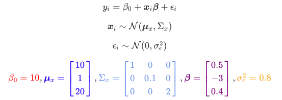

# SquidSim R package

## 1. SquidSim R package

The tutorial is in: <https://squidgroup.org/squidSim_vignette/1.2-corpred.html>

```{r}
devtools::install_github("squidgroup/squidSim")
library(squidSim)
```

Important function:

``` r
simulate_population(
  data_structure, 
  n, 
  parameters, 
  n_response=1, 
  response_names,
  family="gaussian", 
  link="identity", 
  model, 
  known_predictors, 
  pedigree, 
  pedigree_type, 
  phylogeny, 
  phylogeny_type, 
  cov_str, 
  sample_type,
  sample_param,
  n_pop=1
)
```

### 1.1 Simple Linear regression model simulation

$$
y_i = \beta_0+x_i\beta+\epsilon_i\\
x_i\sim N(\mu_x, \Sigma_x)\\
\epsilon \sim N (0, \sigma_\epsilon^2)
$$

```{r}
squid_data <- simulate_population(
  n=2000,
  response_name = "body_mass",
  parameters = list(
    intercept=10,
    observation = list(
      names = c("temperature","rainfall", "wind"),
      beta = c(0.5,-0.3, 0.4)    
    ),
    residual = list(
      vcov = 0.8
    )
  )
)
```

```{r}
data <- get_population_data(squid_data)
head(data)
```

`squid_pop` in result is an identifier for the population number, but is not relevant here.

If we consider more complicated structure:

{width="614"}

```{r}
  squid_data <- simulate_population(
     n=2000,
     response_name = "body_mass",
     parameters = list(
       intercept = 10,
       observation = list(
         names = c("temperature","rainfall", "wind"),
         mean = c(10,1,20),
         vcov = c(1,0.1,2),
         beta = c(0.5,-3, 0.4)
       ),
       residual = list(
         vcov = 0.8
       )
     )
   )
```

```{r}
data <- get_population_data(squid_data)

coef(lm(body_mass ~ temperature + rainfall + wind, data))
```

```{r}
library(scales)
par(mfrow=c(1,3))
plot(body_mass ~ temperature + rainfall + wind, data, pch=19, cex=0.5, col=alpha(1,0.5))å
```

### Correlated predictors
